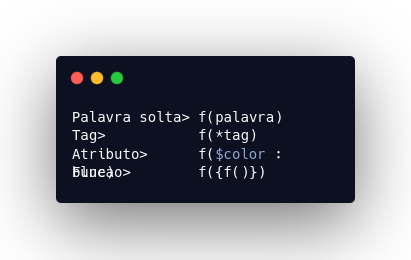
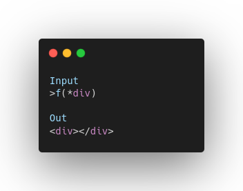
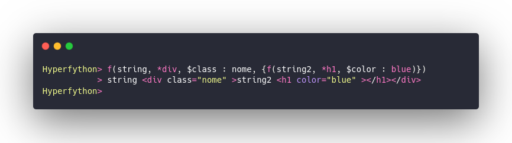

# Trabalho Final Compiladores

### Linguagem Hyperfython v.2.0

O projeto tem como finalidade criar uma linguagem para escrever HTML em outra sintaxe e exportar em um compilador de nossa autoria.

### Como usar
Para escrever um código na linguagem Hyperfython, o programador deve serguir a seguinte sintaxe: 

* O código deve iniciar com a letra 'f' seguido de parenteses '( )'
* Dentro dos parenteses é aceito: uma string, uma tag e seus atributos, e uma nova função, onde pode se repetir as entradas, respeitando essa ordem: 
    >f(palavra fora, *tag, $atributo : nome, { f(palavra fora, *tag, $atributo : nome)} )
* As regras de sintaxe de cada tipo estão exemplificadas abaixo:
    * Tag deve ser antecedido por '*'
    * Atributo deve ser antecedido por '$'
    * Uma palavra fora ou entre Tags pode ser escrita livremente, desde que entre uma função
    * Uma função deve estar entre '{ }'

 

* Exemplo de In/Output

* Exemplo em execução

### Para rodar o projeto:
Para a execução do projeto basta clonar o repositório, acessar a pasta 'hyperfython'
É aconselhável criar uma máquina virtual e instalar os requirements, para fazer isso basta dar os seguintes comandos dentro da pasta do projeto:

> python3 -m venv env

> pip install requirements.txt

Para executar o terminal iterativo digite o comando a seguir:

> python3 \_\_main\_\_.py

Para rodar os testes entre na pasta test e digite o seguinte comando:

> pytest teste.py
### Metodologia
* Utilizamos a biblioteca Lark do Python, para facilitar o desenvolvimento do Grammar.
* Criamos o Transformer que retorna a Sexpr a ser analizada pelo Eval.
* Desenvolvemos o Eval para avaliar se a sintaxe é válida (se a tag está dentro das que consideramos válidas)
* Se passar pelo Eval chamamos uma função que retorna a string do código em HTML e printamos ela na tela

## Autores
|Nome|matricula|github|
|:---:|:---:|:---:|
|Damarcones Porto|15/0122187|damarcones|
|Geraldo Victor|17/0011119|geraldovictor|
|Hugo Aragão|16/0124581|codehg|
|Leonardo Barreiros|15/0135521|leossb36|

##### Desenvolvido discente do curso de Engenharia de software pela Universidade de Brasília para a disciplina de compiladores
