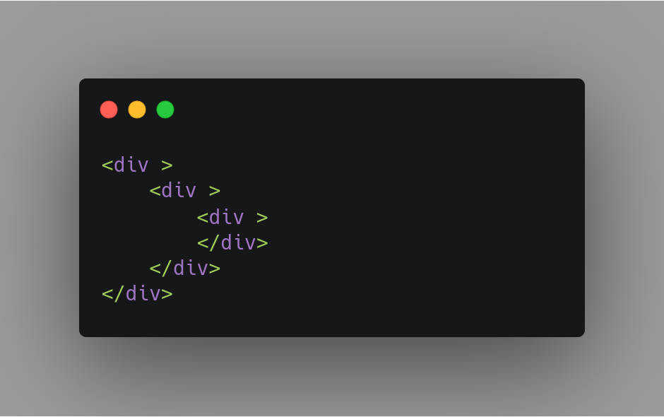

# Trabalho Final Compiladores

### Linguagem Hyperfython

O projeto tem como finalidade criar uma linguagem para escrever HTML em outra sintaxe e exportar em um compilador de nossa autoria.

### Como usar
Para escrever um código na linguagem Hyperfython, o programador deve serguir a seguinte sintaxe: 

* O código deve iniciar com a palavra 'fython' seguido de colchetes '[ ]'
* Dentro dos colchetes o usário pode passar o conteúdo que estará dentro da tag, seus atributos, e uma tag dentro de outra.
* Seguindo a ideia de um dicionário, e de acordo com a gramática definida será: um bloco (que pode possuir vários dicionários), um dicionário (que pode possuir mais de um atributo chave-valor). E toda essa parte pode ser chamada recursivamente.

Exemplo de input:  

Exempro de output:  

### Metodologia
* Utilizamos a biblioteca Lark do Python, para facilitar o desenvolvimento do Grammar.
* Criamos o Transformer que retorna a string a ser analizada pelo Eval.
* Desenvolvemos o Eval para exportar o código na estrutura de HTML.

## Autores
|Nome|matricula|github|
|:---:|:---:|:---:|
|Damarcones Porto|15/0122187|damarcones|
|Geraldo Victor|17/0011119|geraldovictor|
|Hugo Aragão|16/0124581|codehg|
|Leonardo Barreiros|15/0135521|leossb36|

##### Desenvolvido discente do curso de Engenharia de software pela Universidade de Brasília para a disciplina de compiladores
